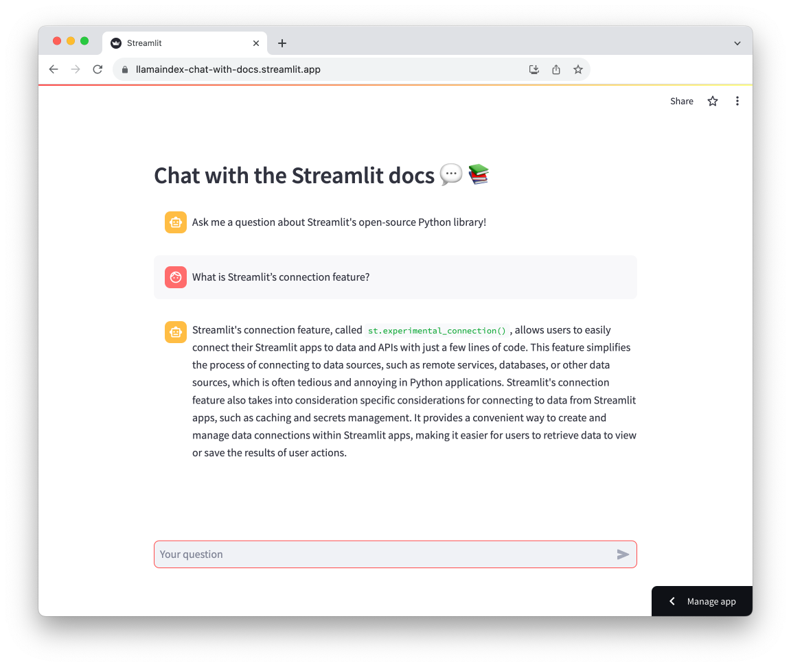

# 🦙📚 LlamaIndex - Chat with the Streamlit docs

Build a chatbot powered by LlamaIndex that augments GPT 3.5 with the contents of the Streamlit docs (or your own data).

## Overview of the App



- Takes user queries via Streamlit's `st.chat_input` and displays both user queries and model responses with `st.chat_message`
- Uses LlamaIndex to load and index data and create a chat engine that will retrieve context from that data to respond to each user query

## Demo App

[](https://llamaindex-chat-with-docs.streamlit.app/)

## Get an OpenAI API key

You can get your own OpenAI API key by following the following instructions:
1. Go to https://platform.openai.com/account/api-keys.
2. Click on the `+ Create new secret key` button.
3. Next, enter an identifier name (optional) and click on the `Create secret key` button.
4. Once you have your API key, you will need to store this in .streamlit/secrets.toml. IF this file doesnt exist, create it with the following
```openai_key = "your-key-here-AND-MAKE-SURE-TO-ADD-FILE-TO-GITIGNORE"```

> [!CAUTION]
> You **NEED** to add ```.streamlit/secrets.toml``` to your .gitignore. Head over to the projects .gitignore and uncomment it.

## Try out the app

Once the app is loaded, enter your question about the Streamlit library and wait for a response.

## Getting started

### Dev environment
Get set up with your local environment.  
If you dont ahve pipenv, [install it](https://pipenv.pypa.io/en/latest/installation.html)  
```bash
pipenv --python 3.10
```

Start using the pipenv environment just created. You should see "(llamaindex-chat-with-streamlit-docs)" at the start of your terminal prompt.  
```bash
pipenv shell
```

Tell pipenv to take a look at the Pipfile and download the packages and their deps.  
```bash
pipenv install
```
